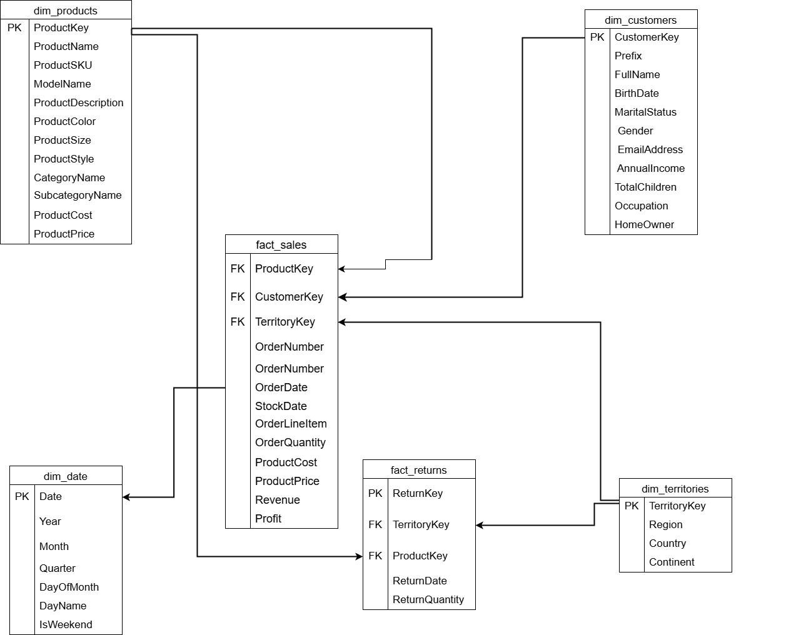

# 🚀 AdventureWorks Data Engineering Pipeline

<p align="center">


</p>

---

# 📖 About This Project

This repository contains my first end-to-end Data Engineering project.

I built this project to understand how a modern batch data pipeline works in a real-world environment. Instead of learning each tool separately, I wanted to connect everything together—from data ingestion to reporting.

The project starts by extracting data from AdventureWorks platform and convert them into csv and load them into S3 and second fase was reading raw AdventureWorks data from AWS S3. Apache Airflow orchestrates the pipeline, Databricks processes the data using PySpark, Delta Lake stores each Medallion layer, and the final Gold tables are used to build Power BI dashboards.

While building this project, my goal wasn't just to make the pipeline work. I wanted to learn how different components work together, how data flows through each layer, and how Data Engineers design reliable and maintainable pipelines.

This project covers:

- End-to-end ETL/ELT pipeline
- Medallion Architecture (Bronze, Silver, Validation, Gold)
- Apache Airflow orchestration
- Databricks Workflows
- Delta Lake MERGE operations
- Incremental data processing
- Data quality validation
- Star Schema data modeling
- Databricks SQL Warehouse
- Power BI dashboards
- Dockerized Airflow
- GitHub Actions CI

Although this is a portfolio project, I tried to follow production-inspired practices wherever possible and document the design decisions throughout the repository.

---

# 🎯 Why I Built This

I created this project to challenge myself with a complete Data Engineering workflow instead of building small isolated examples.

During this project I learned how data moves through a modern data platform, how orchestration works, how Delta Lake handles incremental data, how to model analytical data, and how to deliver business-ready datasets for reporting.

More importantly, I learned how to debug failures, improve pipeline design, and think about Data Engineering beyond writing code.

---

# 🙌 Feedback Welcome

This is my **first Data Engineering project**, and I'm still learning.

If you notice something that could be improved, an engineering decision that could be better, or a practice that isn't production-ready, I'd genuinely appreciate your feedback.

Constructive criticism helps me become a better Data Engineer, and I'd much rather learn by fixing mistakes than leave them unnoticed.

If you have suggestions, advice, or would simply like to connect and discuss Data Engineering, feel free to reach out to me on **LinkedIn**.

I'm always open to learning from experienced engineers and improving my work.

# 🏗️ Project Architecture

One of the main goals of this project was to understand how data moves through a complete Data Engineering pipeline. Instead of processing everything in a single script, I followed the Medallion Architecture to organize the data into different layers, making the pipeline easier to maintain, debug, and scale.

The pipeline starts when raw AdventureWorks CSV files are uploaded to an AWS S3 bucket. Apache Airflow monitors and orchestrates the workflow, while Databricks Workflows execute the PySpark notebooks responsible for processing each layer of the pipeline.

Each layer has a specific responsibility:

### 🥉 Bronze Layer

The Bronze layer stores the raw source data exactly as it arrives from Amazon S3.

At this stage I don't perform any business transformations. The main goal is to preserve the original data so it can always be traced back if something goes wrong later in the pipeline.

I also add ingestion metadata such as processing timestamps and a `pipeline_run_id` that allows the pipeline to process data incrementally.

---

### 🥈 Silver Layer

The Silver layer is where the data starts becoming useful.

In this layer I clean inconsistent values, standardize data types, remove duplicates, and apply business transformations using PySpark.

Instead of rewriting the entire dataset every time, I use Delta Lake MERGE operations to perform incremental updates based on the current pipeline run.

---

### ✅ Validation Layer

Before publishing data to the Gold layer, I run a separate validation step.

The purpose of this layer is to detect common data quality issues before they reach the reporting layer.

Some of the validations include:

- Checking for null values in important columns
- Verifying numeric values are valid
- Detecting duplicate records
- Logging validation results for every pipeline execution

Separating validation from transformation makes the pipeline easier to troubleshoot and helps identify data quality issues earlier.

---

### 🥇 Gold Layer

The Gold layer contains business-ready tables designed for reporting and analytics.

Here I build a Star Schema consisting of fact and dimension tables.

These tables are optimized for business users and Power BI dashboards instead of raw data processing.

The final Gold tables are published through Databricks SQL Warehouse, allowing Power BI to connect directly to curated analytical data.

---

# 🔄 End-to-End Pipeline Flow

The complete workflow follows the architecture below.


This separation allows each layer to have a single responsibility, making the pipeline easier to maintain and extend in the future.

---

# ⚡ Incremental Processing

One thing I wanted to avoid was reprocessing the entire dataset every time the pipeline runs.

To solve this, I implemented incremental processing using a unique `pipeline_run_id`.

Each pipeline execution processes only the newly ingested records, which are then merged into Delta Lake tables using MERGE operations.

This approach reduces unnecessary processing while keeping the data up to date.

---

# 🛠️ Technologies Used

This project helped me gain hands-on experience with several tools commonly used in modern Data Engineering.

| Tool | Purpose |
|------|---------|
| Python | Pipeline development |
| PySpark | Distributed data processing |
| Apache Airflow | Workflow orchestration |
| Databricks Workflows | Notebook execution |
| Delta Lake | ACID storage & incremental MERGE |
| AWS S3 | Raw data storage |
| Unity Catalog | Table management |
| Databricks SQL Warehouse | SQL endpoint for reporting |
| Power BI | Dashboard creation |
| Docker | Local Airflow environment |
| GitHub Actions | Continuous Integration |

---

# 💡 What I Learned

This project taught me much more than how to write PySpark code.

Some of my biggest takeaways were:

- Breaking a large pipeline into small, maintainable layers.
- Understanding why orchestration is just as important as transformation.
- Designing incremental pipelines instead of full refresh pipelines.
- Building a dimensional model for analytics.
- Thinking about data quality before reporting.
- Using GitHub Actions to automatically validate changes.
- Documenting architecture instead of only writing code.

Building this project helped me understand how different Data Engineering tools work together to solve a complete business problem instead of learning them in isolation.
---
# 📊 Data Warehouse Design

After transforming and validating the data, I built a Star Schema in the Gold layer to make reporting faster and easier.

Instead of querying raw transactional data, the reporting layer is organized into fact and dimension tables. This approach improves readability and follows a common design used in analytical data warehouses.

### Fact Tables

- **fact_sales**
- **fact_returns**

### Dimension Tables

- **dim_customers**
- **dim_products**
- **dim_date**
- **dim_territories**

This structure makes it simple to analyze business metrics such as sales, profit, returns, customer behavior, product performance, and regional performance.

---

## ⭐ Star Schema

 

---

# 📈 Power BI Dashboard

The final Gold tables are connected to Databricks SQL Warehouse and visualized using Power BI.

Instead of creating KPI tables inside the data pipeline, I chose to calculate business metrics in Power BI using DAX measures. This keeps the data pipeline focused on preparing clean and reliable datasets while allowing the reporting layer to handle business calculations.

The dashboard currently includes multiple report pages covering:

- Executive Overview
- Sales Analysis
- Customer Analysis
- Product Performance
- Territory Performance
- Return Analysis

These dashboards allow business users to explore data interactively without querying the underlying warehouse directly.

---

## 📷 Dashboard Preview


---

# 🔄 CI/CD

One of my goals for this project was to learn not only how to build a pipeline but also how to manage it using version control and Continuous Integration.

Every change is tracked with Git, and GitHub Actions automatically validates the repository whenever new code is pushed.

This gives me confidence that future changes don't accidentally break the project.

The current CI pipeline includes:

- Repository validation
- Python dependency installation
- Workflow verification
- Basic project validation before merging changes

Although this is a learning project, adding CI helped me understand how automated validation fits into a real software development workflow.

---

# 📁 Repository Structure

The project is organized to keep orchestration, data processing, documentation, and reporting separate.

```text
Adventureworks-Data-Engineering-Pipeline
│
├── .github/
│   └── workflows/
│
├── dags/
│   └── adventure_work_project/
│
├── databricks/
│   ├── bronze/
│   ├── silver/
│   ├── validation/
│   └── gold/
│
├── docs/
│── Dataset/
├── powerbi/
│
├── Dockerfile
├── docker-compose.yaml
├── requirements.txt
├── README.md
└── .env.example
```

Keeping the repository organized made it much easier to work on different parts of the project independently and reflects how I wanted to structure a real-world Data Engineering project.
